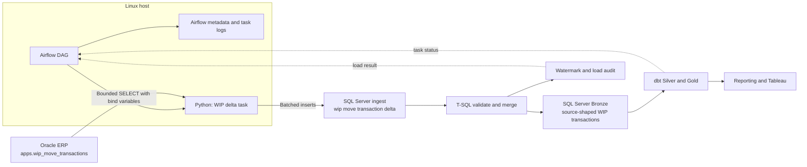

# Airflow-Driven Oracle to SQL Server Architecture

## Decision Status

**Working baseline — medium, high-performing architecture.**
## Architecture Decision

```text
Airflow-driven schedule and observability
  + Python direct-to-Oracle incremental extraction
  + Python batch delivery to SQL Server ingest tables
  + SQL Server set-based Bronze merge, watermark, and audit
  + dbt Silver/Gold transformation after Bronze succeeds
```

Airflow owns scheduling, retry, alerting, backfills, and cross-system task
dependencies. Python owns source transport. SQL Server owns durable landing,
set-based merge, indexes, and load-control state. dbt owns downstream model
transformation.

The Airflow task uses separate least-privilege accounts:

```text
svc_airflow_oracle_reader  SELECT on approved Oracle source objects
svc_airflow_sqlwriter      INSERT to ingest; EXECUTE approved merge procedures
```

Credentials belong in an approved secret manager or Airflow Connection backend,
not Git, DAG code, or a local `.env` file. The Linux host must be explicitly
allowed to reach both Oracle and SQL Server.

## Data Architecture



Solid arrows represent data movement. Dashed arrows are control/status feedback.
Airflow carries `run_id`, row counts, and task state; it does not carry data
sets through task metadata.

## Component Boundaries

| Component | Responsibility | Must not own |
|---|---|---|
| Airflow | Schedules, dependencies, retries, alerts, run visibility | Business transformation or data-frame payloads |
| Python | Oracle bind query, batch streaming, SQL Server landing | Row-by-row target upsert logic |
| SQL Server | Ingest, Bronze tables, merge, watermark, audit, indexes | Oracle source query logic |
| dbt | Reusable Silver/Gold transformation and tests | Source extraction |

The direct Python path replaces `OPENQUERY`. Retain `OPENQUERY` only as a
transitional fallback if the Airflow host cannot be approved for direct Oracle
access; do not use both paths for the same source.

## First Implementation: WIP Move Transactions

### Source Contract

| Field | Role |
|---|---|
| `apps.wip_move_transactions` | Oracle source table |
| `transaction_id` | Business/merge key |
| `last_update_date` | Candidate incremental watermark |
| `organization_id = 1213` | Existing source constraint to confirm and configure |
| `transaction_date` | Reporting-date attribute; not the ingestion watermark |

The source contract requires DBA confirmation that `last_update_date` is
reliably populated and the approved predicate is index-supported. Hard deletes
need a separate reconciliation or soft-delete strategy.

### Functional Flow

```text
LoadResult = F(source contract, prior watermark, upper watermark, run ID)
```

```python
def run_wip_move_transactions_incremental(run_id: str) -> dict:
    acquire_sqlserver_application_lock("wip_move_transactions")

    lower = read_last_successful_watermark("wip_move_transactions")
    upper = oracle_current_timestamp()
    safe_lower = lower - timedelta(hours=2)
    create_or_reset_sqlserver_landing_batch(run_id)

    for rows in oracle_fetchmany(
        """
        SELECT transaction_id, last_update_date, creation_date,
               organization_id, wip_entity_id, transaction_date,
               transaction_quantity, transaction_uom
        FROM apps.wip_move_transactions
        WHERE organization_id = :organization_id
          AND last_update_date > :safe_lower
          AND last_update_date <= :upper
        """,
        binds={"organization_id": 1213,
               "safe_lower": safe_lower,
               "upper": upper},
        batch_size=5_000,
    ):
        insert_batch_into_sqlserver_ingest(rows, run_id)

    return execute_sqlserver_merge_procedure(
        source_name="wip_move_transactions",
        load_run_id=run_id,
        upper_watermark=upper,
    )
```

The SQL Server merge procedure validates the landing batch, updates/inserts
Bronze set-wise, records the result, and advances the watermark atomically only
after success. A failure leaves the watermark unchanged; an Airflow retry must
reuse or safely clear the same batch identity.

### Required SQL Server Objects

```text
ingest.oracle_wip_move_transactions_delta   one load batch
bronze.oracle_apps_wip_move_transactions    source-shaped current state
etl.SourceWatermark                          last successful checkpoint
etl.LoadRun                                  audit and failure information
etl.usp_MergeWipMoveTransactions             validate, merge, audit, watermark
```

## Operating Policy

Start with one concurrent Oracle load and an hourly or daily schedule. Move to
15-minute loads only after the pilot has measured source impact and recovery
behavior. At that cadence, use a 60–120 minute safety lookback and ensure only
one WIP task can run at a time.

| Control | Policy |
|---|---|
| Source query | Explicit columns, bind variables, indexed delta filter, no `SELECT *` |
| Batch size | Start near 5,000 rows; tune from runtime and source impact |
| Landing | Insert into an `ingest` table before any Bronze change |
| Idempotency | A retry cannot duplicate Bronze data or advance the watermark twice |
| Audit | Record source, run ID, bounds, counts, outcome, and error message |
| Concurrency | One source task first; increase only with DBA approval |
| Transform cadence | Bronze every 15 minutes if needed; dbt/BI hourly until consumers need more |

## Code and Deployment Boundary

Implement this in a separate private ingestion repository, not this public dbt
reference repository:

```text
oracle-sqlserver-ingestion/
  dags/wip_incremental.py
  src/ingestion/oracle_extract.py
  src/ingestion/sqlserver_land.py
  src/ingestion/load_control.py
  sql/001_bronze_wip.sql
  sql/002_merge_wip.sql
  tests/
  pyproject.toml
  Dockerfile
```

## Scale Trigger

The baseline uses `python-oracledb` batch fetching and direct SQL Server
landing. Polars is optional for a measured Python-side batch transform. PySpark
is not part of the initial architecture: introduce it only for sustained
large-scale backfills, large-file joins, or distributed compute needs that
cannot meet their window using bounded Python batches and approved source
concurrency.

## References

- Apache Airflow architecture: <https://airflow.apache.org/docs/apache-airflow/stable/core-concepts/overview.html>
- Oracle `python-oracledb` tuning: <https://python-oracledb.readthedocs.io/en/latest/user_guide/tuning.html>
- Spark JDBC source guidance: <https://spark.apache.org/docs/latest/sql-data-sources-jdbc.html>
